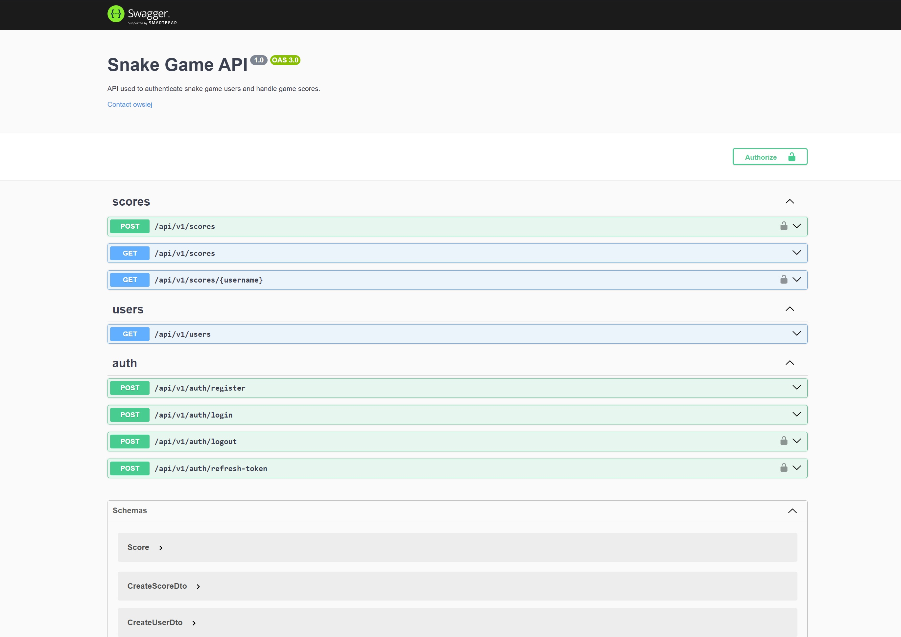

<a name="readme-top"></a>

<br />
<div align="center">

<h3 align="center">Score API</h3>

  <p align="center">
    API allowing register/login users and get/post scores using JWT authentication.<br>
<b>🚀DEPLOYED ON</b>: https://europe-west1-snake-game-project-e8b0d.cloudfunctions.net/api/docs

</div>

<!-- TABLE OF CONTENTS -->
<details>
  <summary>Table of Contents</summary>
  <ol>
    <li>
      <a href="#about-the-project">About The Project</a>
      <ul>
        <li><a href="#authentication">Authentication</a></li>
        <li><a href="#additional-features">Additional Features</a></li>
        <li><a href="#built-with">Built With</a></li>
      </ul>
    </li>
    <li>
      <a href="#getting-started">Getting Started</a>
      <ul>
        <li><a href="#prerequisites">Prerequisites</a></li>
        <li><a href="#installation">Installation</a></li>
        <li><a href="#deployment">Deployment</a></li>
      </ul>
    </li>
    <li><a href="#usage">Usage</a></li>

  </ol>
</details>

<!-- ABOUT THE PROJECT -->

## About The Project

The whole purpose of this project was to implement a backend server for my snake game frontend [available in a separate repository: GitHub](https://github.com/owsiej/snake-game-angular).

### Authentication:

The backend provides an API for user authentication:

- **Register** (`/register`): Creates a new user account.
- **Login** (`/login`): Authenticates an existing user. Upon successful login, the response includes an access token and a refresh token. The refresh token is securely stored in the database associated with the user.
- **Logout** (`/logout`): Invalidates the user's session by removing the refresh token from their database record.
- **Refresh Token** (`/refresh-token`): Allows users to obtain a new access token when the existing one expires.

### Additional Features:

- **Swagger Documentation** (`/docs`): Provides detailed API documentation (available after server deployment).

<p align="right">(<a href="#readme-top">back to top</a>)</p>

### Built With

<div style="display: flex;">
<a href="https://www.npmjs.com">
  
</a>
<a href="https://nestjs.com">
  
</a>
<a href="https://www.mongodb.com">
  

<a href="https://swagger.io/tools/swaggerhub/">
  
  <a href="https://code.visualstudio.com">
  
  <a href="https://www.postman.com">
  
</div>
<p align="right">(<a href="#readme-top">back to top</a>)</p>

<!-- GETTING STARTED -->

## Getting Started

### Prerequisites

First start with installing `npm`.

```sh
npm install npm@latest -g
```

### Installation

1. Clone the repo
   ```sh
   git clone https://github.com/owsiej/scores-api
   ```
2. Jump to root directory
   ```sh
   cd scores-api
   ```
3. Install NPM packages
   ```sh
   npm install
   ```
4. Create `.env` file with following variables:

   ```js
   MONGO_CONNECTION_STRING = ;
   MONGO_DATABASE_NAME = ;
   PORT = ;
   JWT_SECRET_KEY = ;
   JWT_REFRESH_SECRET_KEY = ;
   ALLOW_ORIGIN = ;
   ```

### Deployment

Run server

```sh
npm run start
```

<p align="right">(<a href="#readme-top">back to top</a>)</p>

<!-- USAGE EXAMPLES -->

## Usage

After deployment, all available endpoints you can check at `/docs`.


<p align="right">(<a href="#readme-top">back to top</a>)</p>
